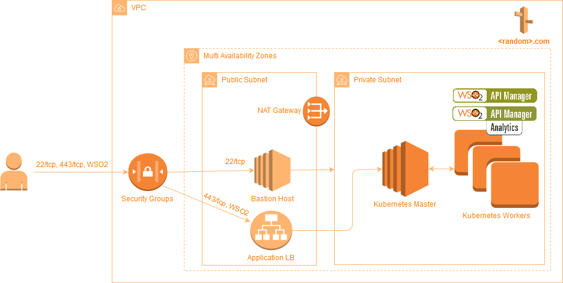

# Integration Platform demo on AWS

This demo project based on terraform modules published here: https://github.com/eleks/terraform-kubernetes-demo

So, for details please reffer this parent project.

## Infrastructure Overview  



**NOTE:** the following instruction works under linux and windows

## 0. Prerequisites 

**Create AWS iam user/group with the following permissions:**
1. AmazonEC2FullAccess
2. AmazonVPCFullAccess 
3. AmazonRoute53FullAccess
4. AmazonElasticFileSystemFullAccess
5. AmazonS3FullAccess

**Download terraform**
https://www.terraform.io/downloads.html

The terraform configs created for the version 0.11.x

## 1. Generate your deployer key pair:  
go into the project root directory and generate the deployer-key and public ssh cert

or put into `.ssh` folder your own key and public part for it

```shell
ssh-keygen -t rsa -f ~/.ssh/deployer-key
```

This key you could use to connect bastion server 

## 2. Define AWS credentials
Create file `terraform/aws/1.auto.tfvars` with content:
```shell
aws_access_key = "Here put your access_key"
aws_secret_key = "Here put your secret_key"
```
Actually the file should match `*.auto.tfvars` to be loaded automatically.

## 3. Create terraform workspace
go into the directory `terraform/aws`
```shell
cd terraform/aws
terraform workspace new api-demo
```

## 4. Initialize terraform
The following command verifies your `*.tf` configuration and downloads providers and modules required.
```shell
terraform init
```
## 5. Deploy Integration Platform
This command compares local configuration with current state and suggests changes to be applied. Type `yes` when asked.
```shell
terraform apply
```
  
## 6. Certificate (Important)

We are using self-signed certificate  for Application LoadBalancer.
It is signed with custom CA certificate. So, to make server certificate valid for your brawser/mobile import the following file into the truststore:

[ca.docker.local.cer](https://github.com/eleks/terraform-kubernetes-demo/blob/master/certificates/ca.docker.local.cer)

Find details here: [certificates/README.md](https://github.com/eleks/terraform-kubernetes-demo/blob/master/certificates/README.md)
